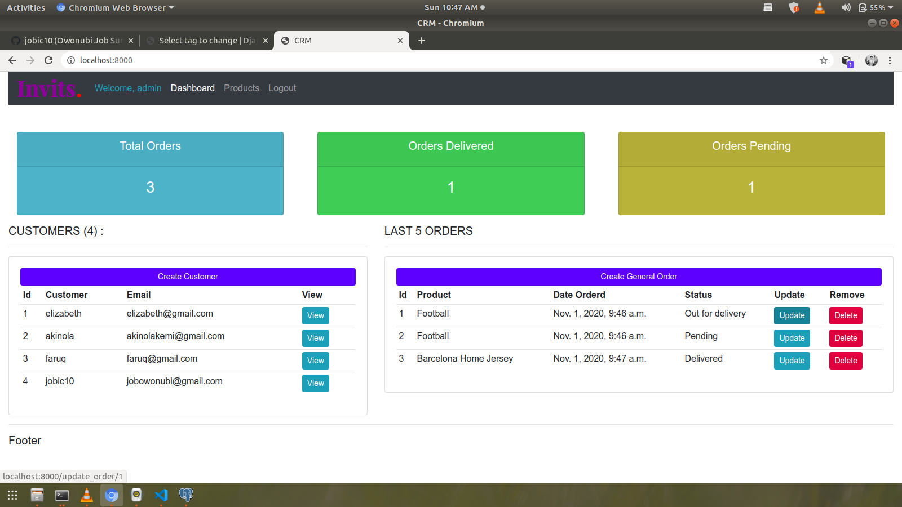
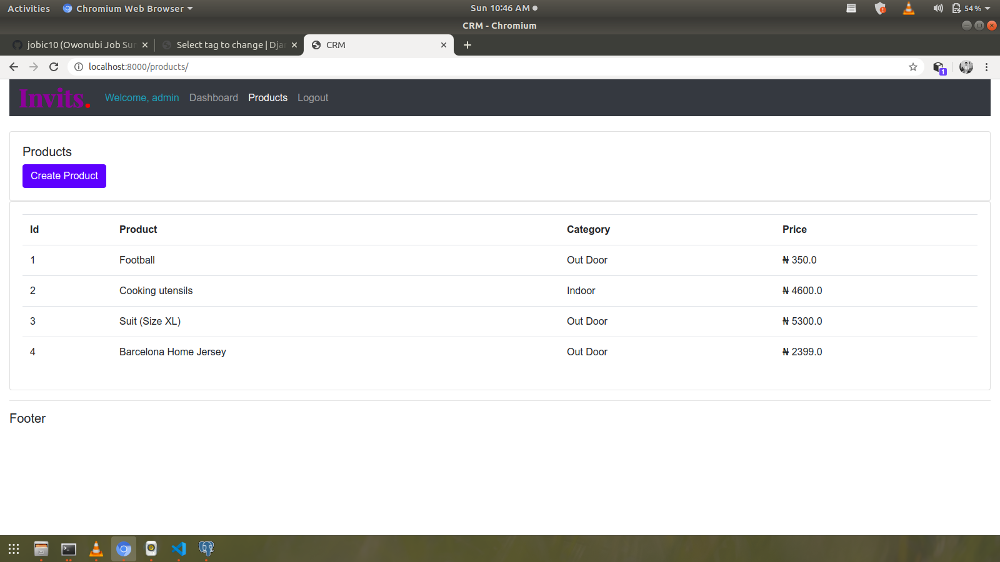
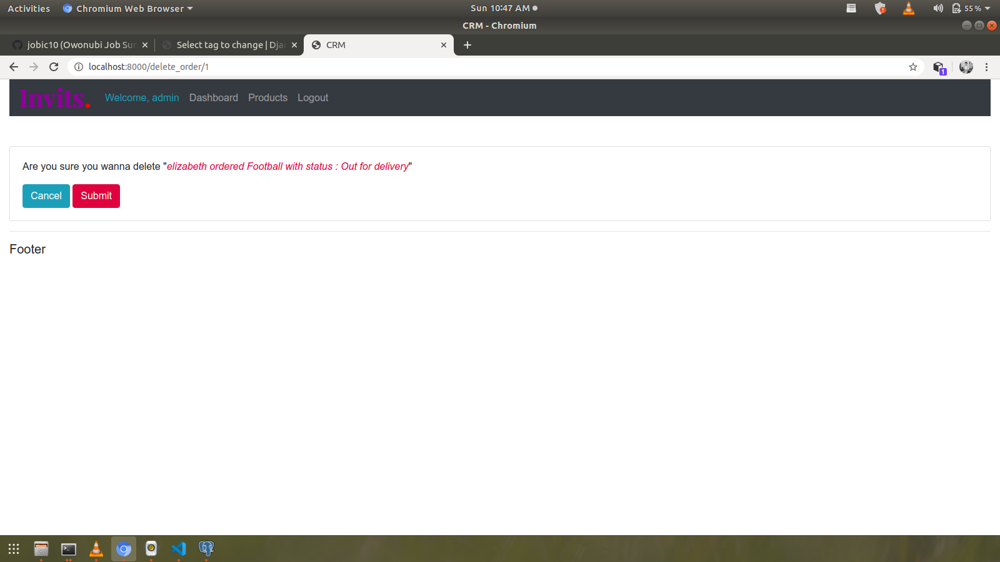
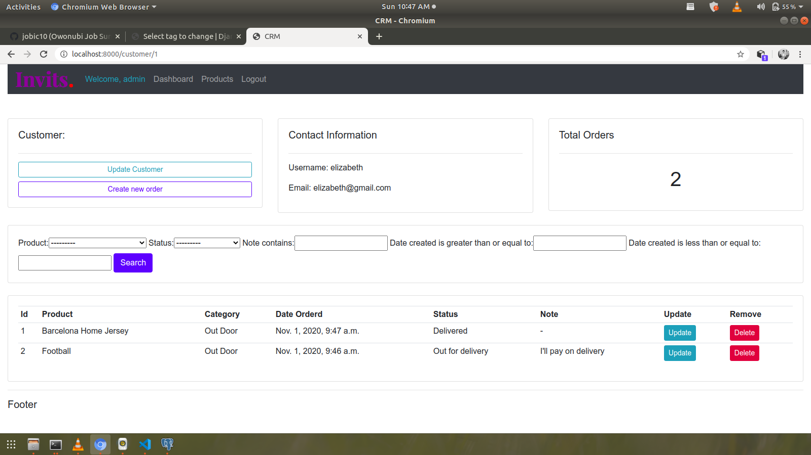

# crmwithdjango

## 📸 ScreenShots

## Project's Journey
- [x] Create account app 
- [x] Create Templates 
- [x] Static files
- [x] Create Order
- [x] Create General Order
- [x] Search using Django Filters
- [x] Delete Order
- [x] Update Order
- [x] User authentication
- [x] Logout User
- [x] Decorators
- [x] Image Upload
- [x] User signals (post_save)
- [x] Postgres Connection

## Instructions:
- [x] Add tags from Default Django 